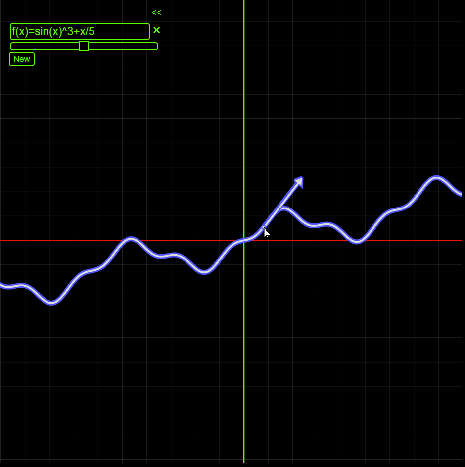
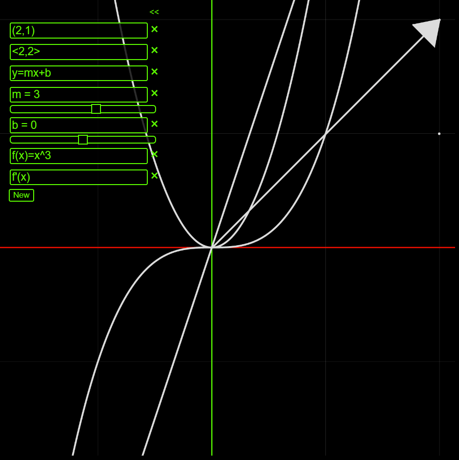
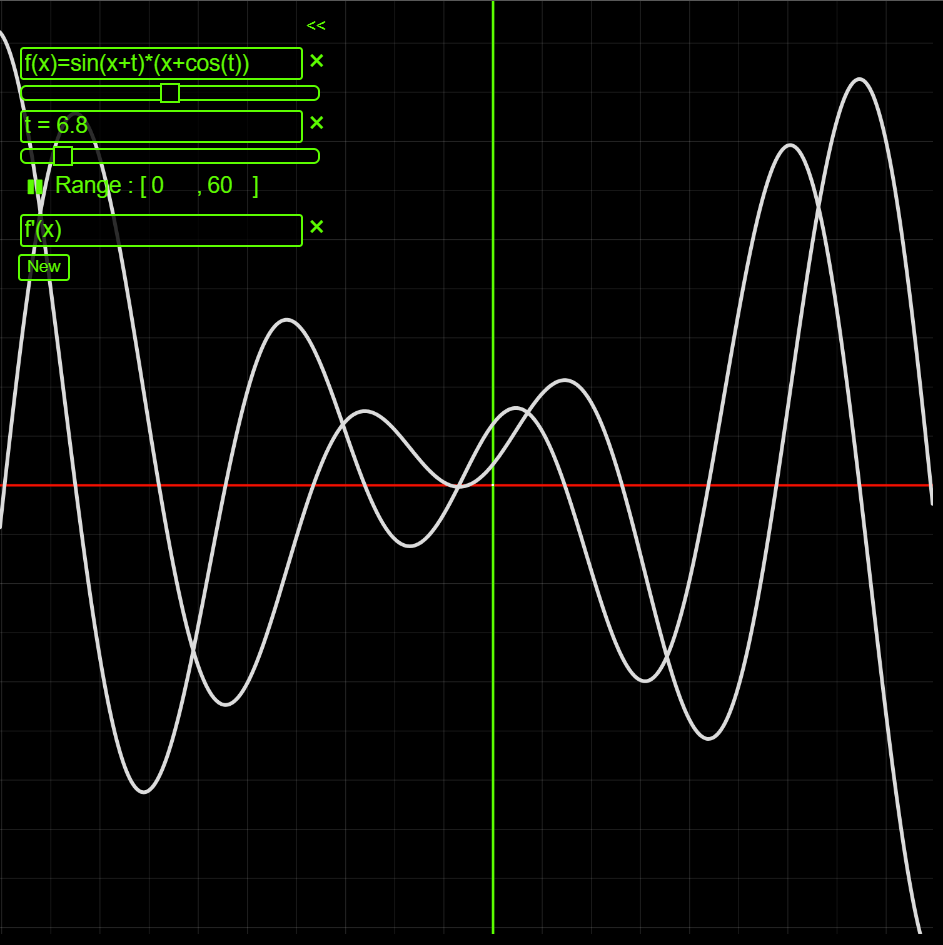
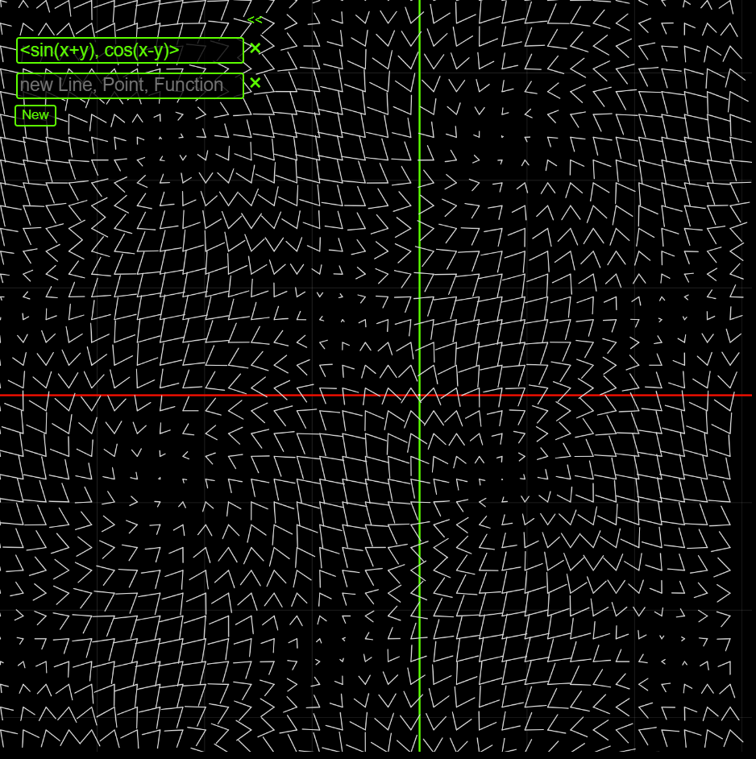
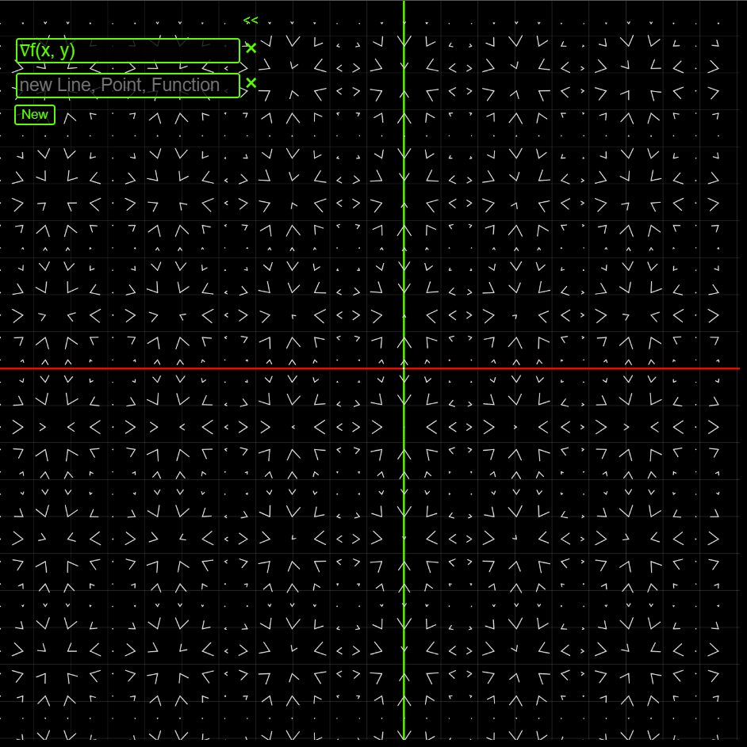

# weber-84
Web Based Graphing Calculator, designed to help explore certain math principles, namely matrix transformations.

You can view a working version of it here: [Weber-84 hosted by Netlify](https://elaborate-pegasus-3533db.netlify.app/). (directions not included)



## Interfacing Modes
| Key | Mode | Description |
| :-- | :--- | :---------- |
| M | Move (Default) | click and drag to move around the graph |
| A | Analyze | hover cursor above a graphed function to see the tangent vector, click to see information about a function or other graph object |
| P | Point | click to create a point (x, y) |
| L | Line | first click starts a line segment, second click finishes it |
| V | Vector | first click starts a vector, second click finishes it |

## Additional Hotkeys
| Key | Action |
| :-- | :----- |
| F | Toggle Fullscreen |
| → | Rotate Graph Clockwise |
| ← | Rotate Graph Counter-Clockwise |
| Scroll | Zoom in/out |

## Input Formats
| Utility | Input Format |
| :----------- | :---------- |
| Function | ```y=...```, ```f(x)=...```, ... |
| Derivatives | ```y'```, ```f'(x)```, ... |
| Vector | ```<x, y>``` |
| Point | ```(x, y)``` |
| Variable | ```a=3```, ```b=x+4```, .... Use in a function: ```y=ax^2+b``` |
| Time Variable | ```t```, variable grows with time |




### Vector Fields
There is currently no way to input a vector field or gradient through the UI, buy you can modify the ```kids``` array on line 19 of [sketch.js](sketch.js).
```
let kids = [
    new Gradient((x,y) => {
        return 2*(x*y*cos(x)**2*sin(y)**2)/(x*y);
    }),
    new VectorField((x, y) => {
        return sin(x+y);
    }, (x, y) => {
        return cos(x-y);
    })
];
```

If the graph contains a vector field or gradient and you add a point by clicking while in 'Add Point' mode (press 'P' hotkey), the point will move along the vector field.





## Set Up

Clone the repo and load the [index.html](index.html) file in your preferred browser.
